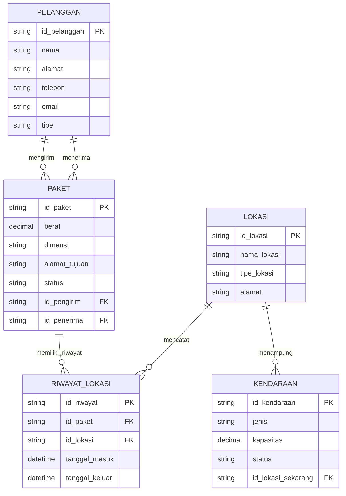

# Latihan UAS 2022 & 2023 - Pak Edi Winarko

## **UAS 2022 - Soal 1: Perusahaan Asuransi XYZ**

### **a. Entitas dalam Database:**
1. PELANGGAN
2. MOBIL
3. KECELAKAAN
4. POLIS_ASURANSI
5. PEMBAYARAN_PREMI

### **b. Atribut Kunci dan Lainnya:**

```sql
PELANGGAN (id_pelanggan, nama, alamat, telepon, email)
MOBIL (no_polisi, merk, model, tahun, id_pelanggan)
KECELAKAAN (id_kecelakaan, tanggal, lokasi, deskripsi, no_polisi)
POLIS_ASURANSI (no_polis, tanggal_mulai, tanggal_berakhir, besaran_premi)
POLIS_MOBIL (no_polis, no_polisi)  -- Tabel penghubung untuk many-to-many
PEMBAYARAN_PREMI (id_pembayaran, tanggal_jatuh_tempo, tanggal_bayar, jumlah, status, no_polis)
```

### **c. Diagram ER:**

```mermaid
erDiagram
    PELANGGAN ||--o{ MOBIL : "memiliki"
    MOBIL ||--o{ KECELAKAAN : "mengalami"
    MOBIL }o--o{ POLIS_ASURANSI : "dicakup" 
    POLIS_ASURANSI ||--o{ PEMBAYARAN_PREMI : "memiliki"
    
    PELANGGAN {
        string id_pelanggan PK
        string nama
        string alamat
        string telepon
        string email
    }
    
    MOBIL {
        string no_polisi PK
        string merk
        string model
        int tahun
        string id_pelanggan FK
    }
    
    KECELAKAAN {
        string id_kecelakaan PK
        date tanggal
        string lokasi
        string deskripsi
        string no_polisi FK
    }
    
    POLIS_ASURANSI {
        string no_polis PK
        date tanggal_mulai
        date tanggal_berakhir
        decimal besaran_premi
    }
    
    POLIS_MOBIL {
        string no_polis FK
        string no_polisi FK
        PRIMARY_KEY (no_polis, no_polisi)
    }
    
    PEMBAYARAN_PREMI {
        string id_pembayaran PK
        date tanggal_jatuh_tempo
        date tanggal_bayar
        decimal jumlah
        string status
        string no_polis FK
    }
```

### **d. Skema Relasional:**

```sql
-- Tabel PELANGGAN
CREATE TABLE PELANGGAN (
    id_pelanggan VARCHAR(10) PRIMARY KEY,
    nama VARCHAR(50),
    alamat TEXT,
    telepon VARCHAR(15),
    email VARCHAR(50)
);

-- Tabel MOBIL
CREATE TABLE MOBIL (
    no_polisi VARCHAR(10) PRIMARY KEY,
    merk VARCHAR(20),
    model VARCHAR(20),
    tahun INT,
    id_pelanggan VARCHAR(10),
    FOREIGN KEY (id_pelanggan) REFERENCES PELANGGAN(id_pelanggan)
);

-- Tabel KECELAKAAN
CREATE TABLE KECELAKAAN (
    id_kecelakaan VARCHAR(10) PRIMARY KEY,
    tanggal DATE,
    lokasi TEXT,
    deskripsi TEXT,
    no_polisi VARCHAR(10),
    FOREIGN KEY (no_polisi) REFERENCES MOBIL(no_polisi)
);

-- Tabel POLIS_ASURANSI
CREATE TABLE POLIS_ASURANSI (
    no_polis VARCHAR(10) PRIMARY KEY,
    tanggal_mulai DATE,
    tanggal_berakhir DATE,
    besaran_premi DECIMAL(15,2)
);

-- Tabel POLIS_MOBIL (untuk relasi many-to-many)
CREATE TABLE POLIS_MOBIL (
    no_polis VARCHAR(10),
    no_polisi VARCHAR(10),
    PRIMARY KEY (no_polis, no_polisi),
    FOREIGN KEY (no_polis) REFERENCES POLIS_ASURANSI(no_polis),
    FOREIGN KEY (no_polisi) REFERENCES MOBIL(no_polisi)
);

-- Tabel PEMBAYARAN_PREMI
CREATE TABLE PEMBAYARAN_PREMI (
    id_pembayaran VARCHAR(10) PRIMARY KEY,
    tanggal_jatuh_tempo DATE,
    tanggal_bayar DATE,
    jumlah DECIMAL(15,2),
    status VARCHAR(20),
    no_polis VARCHAR(10),
    FOREIGN KEY (no_polis) REFERENCES POLIS_ASURANSI(no_polis)
);
```

### **e. Foreign Key:**
```sql
-- Dalam tabel MOBIL
FOREIGN KEY (id_pelanggan) REFERENCES PELANGGAN(id_pelanggan)

-- Dalam tabel KECELAKAAN
FOREIGN KEY (no_polisi) REFERENCES MOBIL(no_polisi)

-- Dalam tabel POLIS_MOBIL
FOREIGN KEY (no_polis) REFERENCES POLIS_ASURANSI(no_polis)
FOREIGN KEY (no_polisi) REFERENCES MOBIL(no_polisi)

-- Dalam tabel PEMBAYARAN_PREMI
FOREIGN KEY (no_polis) REFERENCES POLIS_ASURANSI(no_polis)
```

---

## **UAS 2023 - Soal 1: Perusahaan Pengiriman Paket XYZ**

### **a. Entitas dalam Database:**
1. PELANGGAN
2. PAKET
3. LOKASI
4. RIWAYAT_LOKASI
5. KENDARAAN

### **b. Atribut Kunci dan Lainnya:**

```sql
PELANGGAN (id_pelanggan, nama, alamat, telepon, email, tipe)
PAKET (id_paket, berat, dimensi, alamat_tujuan, status, id_pengirim, id_penerima)
LOKASI (id_lokasi, nama_lokasi, tipe_lokasi, alamat)
RIWAYAT_LOKASI (id_riwayat, id_paket, id_lokasi, tanggal_masuk, tanggal_keluar)
KENDARAAN (id_kendaraan, jenis, kapasitas, status, id_lokasi_sekarang)
```

### **c. Diagram ER:**



### **d. Skema Relasional:**

```sql
-- Tabel PELANGGAN
CREATE TABLE PELANGGAN (
    id_pelanggan VARCHAR(10) PRIMARY KEY,
    nama VARCHAR(50),
    alamat TEXT,
    telepon VARCHAR(15),
    email VARCHAR(50),
    tipe ENUM('pengirim', 'penerima', 'keduanya')
);

-- Tabel PAKET
CREATE TABLE PAKET (
    id_paket VARCHAR(10) PRIMARY KEY,
    berat DECIMAL(10,2),
    dimensi VARCHAR(50),
    alamat_tujuan TEXT,
    status VARCHAR(20),
    id_pengirim VARCHAR(10),
    id_penerima VARCHAR(10),
    FOREIGN KEY (id_pengirim) REFERENCES PELANGGAN(id_pelanggan),
    FOREIGN KEY (id_penerima) REFERENCES PELANGGAN(id_pelanggan)
);

-- Tabel LOKASI
CREATE TABLE LOKASI (
    id_lokasi VARCHAR(10) PRIMARY KEY,
    nama_lokasi VARCHAR(50),
    tipe_lokasi ENUM('truk', 'pesawat', 'bandara', 'gudang'),
    alamat TEXT
);

-- Tabel RIWAYAT_LOKASI
CREATE TABLE RIWAYAT_LOKASI (
    id_riwayat VARCHAR(10) PRIMARY KEY,
    id_paket VARCHAR(10),
    id_lokasi VARCHAR(10),
    tanggal_masuk DATETIME,
    tanggal_keluar DATETIME,
    FOREIGN KEY (id_paket) REFERENCES PAKET(id_paket),
    FOREIGN KEY (id_lokasi) REFERENCES LOKASI(id_lokasi)
);

-- Tabel KENDARAAN
CREATE TABLE KENDARAAN (
    id_kendaraan VARCHAR(10) PRIMARY KEY,
    jenis ENUM('truk', 'pesawat'),
    kapasitas DECIMAL(10,2),
    status VARCHAR(20),
    id_lokasi_sekarang VARCHAR(10),
    FOREIGN KEY (id_lokasi_sekarang) REFERENCES LOKASI(id_lokasi)
);
```

### **e. Contoh Query SQL:**

**Query 1: Melihat semua paket yang sedang dalam perjalanan (masih di kendaraan)**

```sql
SELECT p.id_paket, p.alamat_tujuan, k.jenis as kendaraan, l.nama_lokasi as lokasi_sekarang
FROM PAKET p
JOIN RIWAYAT_LOKASI rl ON p.id_paket = rl.id_paket
JOIN LOKASI l ON rl.id_lokasi = l.id_lokasi
JOIN KENDARAAN k ON l.id_lokasi = k.id_lokasi_sekarang
WHERE p.status = 'dalam_perjalanan'
AND rl.tanggal_keluar IS NULL;
```

**Query 2: Menghitung total paket per pelanggan pengirim**

```sql
SELECT pel.nama, COUNT(p.id_paket) as total_paket_dikirim
FROM PELANGGAN pel
LEFT JOIN PAKET p ON pel.id_pelanggan = p.id_pengirim
GROUP BY pel.id_pelanggan, pel.nama
ORDER BY total_paket_dikirim DESC;
```

---

## **SOAL YANG SAMA (UAS 2022 & 2023):**

### **Soal 2: Normalisasi Tabel Sales**

**Tabel Sales Unnormalized:**
| No_Faktur | Tanggal | Kode_Pelanggan | Nama_Pelanggan | Kode_Barang | Nama_Barang | Harga | Qty |
|---|---|---|---|---|---|---|---|
| F-001 | 12/12/2016 | P-001 | M Fikri Setiadi | B-001 | Sampo | 12.000 | 1 |
| | | | | B-002 | Kopi | 15.000 | 1 |
| F-002 | 13/12/2016 | P-002 | Jack | B-002 | Kopi | 15.000 | 1 |
| | | | | B-003 | Teh | 7.000 | 2 |

#### **Jawaban:**
a. **FD dengan determinant No_Faktur:**
   ```
   No_Faktur → Tanggal, Kode_Pelanggan, Nama_Pelanggan
   ```

b. **FD dengan determinant Kode_Barang:**
   ```
   Kode_Barang → Nama_Barang, Harga
   ```

c. **Partial Dependency:**
   ```
   (No_Faktur, Kode_Barang) → Nama_Pelanggan
   
   Alasan: Nama_Pelanggan hanya bergantung pada No_Faktur (melalui Kode_Pelanggan), 
   bukan pada kombinasi No_Faktur + Kode_Barang.
   ```

d. **Transitive Dependency:**
   ```
   Kode_Pelanggan → Nama_Pelanggan
   
   Alasan: Nama_Pelanggan bergantung pada Kode_Pelanggan, bukan langsung pada primary key.
   ```

e. **Tabel 3NF:**
   ```sql
   -- Tabel Header
   SALES_HEADER (No_Faktur, Tanggal, Kode_Pelanggan)
   Primary Key: No_Faktur
   
   -- Tabel Detail
   SALES_DETAIL (No_Faktur, Kode_Barang, Qty)
   Primary Key: (No_Faktur, Kode_Barang)
   
   -- Tabel Pelanggan
   PELANGGAN (Kode_Pelanggan, Nama_Pelanggan)
   Primary Key: Kode_Pelanggan
   
   -- Tabel Barang
   BARANG (Kode_Barang, Nama_Barang, Harga)
   Primary Key: Kode_Barang
   ```

### **Soal 3: Data Warehouse**

#### **Jawaban:**
a. **Atribut Measure dan Dimensi:**
   ```
   Measure: Total, Quantity, Discount
   Dimensi: Time, Product, Customer, Employee
   ```

b. **Snowflake Schema dengan Normalisasi Customer Dimension:**
   ```sql
   -- Star Schema asli:
   CUSTOMER_DIMENSION (CustomerID, CustomerName, Address, City, Zip)
   
   -- Snowflake Schema:
   CUSTOMER_DIMENSION (CustomerID, CustomerName, Address, CityID)
   CITY_DIMENSION (CityID, CityName, Zip, State, Country)
   ```

c. **Tabel Dimensi untuk Query:**
   ```
   Tabel dimensi yang diakses:
   1. PRODUCT DIMENSION - untuk filter produk 'Monitor'
   2. TIME DIMENSION - untuk filter 5 tahun terakhir
   3. SALES FACT TABLE - untuk mengambil Quantity
   
   Contoh Query:
   SELECT SUM(S.Quantity) as Total_Quantity
   FROM SALES S
   JOIN PRODUCT_DIMENSION P ON S.ProductID = P.ProductID
   JOIN TIME_DIMENSION T ON S.OrderID = T.OrderID
   WHERE P.ProductName = 'Monitor'
   AND T.OrderDate >= DATE_SUB(CURDATE(), INTERVAL 5 YEAR);
   ```

---


Semangat latihan! 🔥
